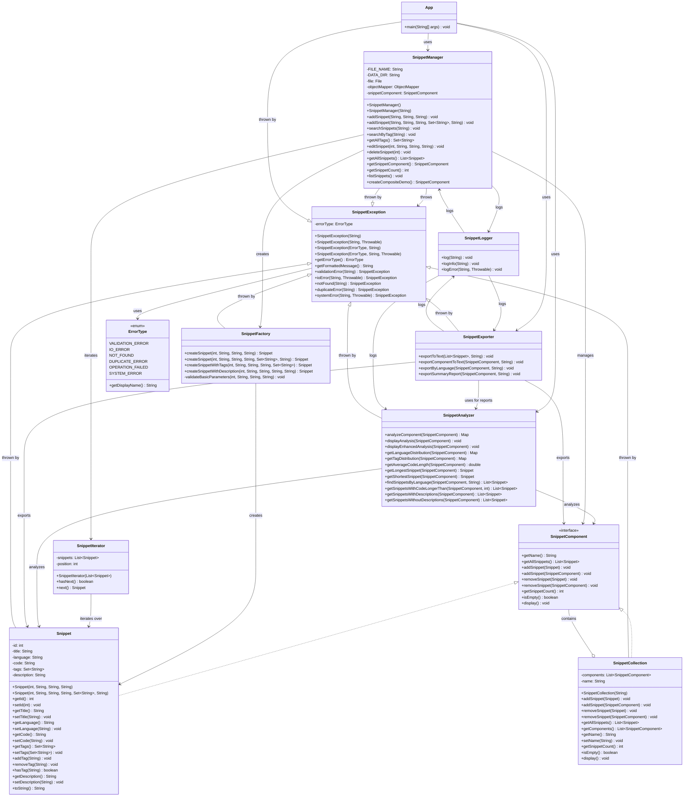

# SNIPPET ORGANIZER 

## Project Objective

Java application that allows users to save, organize, and search code snippets offline, in a fast, secure, and structured way, without the need for a database.

## Data Directory

All application data is stored in the `data/` directory:
- `snippets.json`: - All snippets are stored here as a JSON array. Every add, edit, or delete operation rewrites the entire file to ensure consistency and compatibility with any JSON tool.
- `snippet_organizer.log`: All actions and errors are logged to here. The log file is automatically rotated if it exceeds 1MB.

## User Experience (Step-by-step)

The Snippet Organizer is a command-line application. When you start the app, you'll see a main menu:

```bash
--- CODE SNIPPET ORGANIZER ---
1. Add new snippet
2. Search snippets
3. Edit snippet
4. Delete snippet
5. Export snippets
6. Analyze snippets
7. Manage tags
0. Close application
Select an option:
```

### Option 0: Close Application
- Exits the program.

---

### Option 1: Add New Snippet
- Prompts for **Title**, **Language**, optional **Description**, and optional **Tags** (comma-separated).
- Prompts for code input (multi-line, ends with `X` on a new line).
- Saves the snippet to `data/snippets.json`.

**Example:**
```bash
Title: Bubble Sort Java
Language: Java
Description (optional): Efficient sorting algorithm with O(n²) complexity
Tags (comma-separated, optional): sorting, algorithm, java, bubble-sort
Enter the code (end with "X" on a new line):
for (int i = 0; i < arr.length; i++) {
    ...
}
X
```

---

### Option 2: Search Snippets
- Choose to search by **keyword** (searches title, code, language, tags, description) or by **tag**.
- Displays matching snippets with all metadata.

**Example:**
```bash
Search options:
1. Search by keyword
2. Search by tag
Select search type: 1
Enter search keyword: sort
```
*Shows all snippets matching "sort".*

---

### Option 3: Edit Snippet
- Lists all snippets with IDs.
- Prompts for the ID of the snippet to edit.
- For each field (title, language, code, description, tags), asks if you want to edit it:
  - If yes, prompts for the new value (multi-line for code, comma-separated for tags).
  - If no, leaves the field unchanged.
- Only updates the fields you choose.
- Saves and confirms changes, or notifies if no changes were made.

**Example:**
```bash
Enter snippet ID to edit: 2
Edit title? (y/n): y
New title: Improved Bubble Sort
Edit language? (y/n): n
Edit code? (y/n): y
Enter the new code (end with "X"):
for (int i = 0; i < arr.length - 1; i++) {
    ...
}
X
Edit description? (y/n): n
Edit tags? (y/n): y
New tags (comma-separated, leave blank for none): sorting, java
Snippet edited successfully!
```

---

### Option 4: Delete Snippet
- Lists all snippets with IDs.
- Prompts for the ID of the snippet to delete.
- Confirms deletion.

---

### Option 5: Export Snippets
- Prompts for an output filename.
- Exports all snippets (with tags and descriptions) to a formatted text file in the `data/` directory.

---

### Option 6: Analyze Snippets
- Provides statistics:
  - Language distribution
  - Tag distribution
  - Description statistics
  - Code length analysis
  - Longest/shortest snippets
  
- Offers options to:
  - View snippets by language
  - View snippets with/without descriptions
  - View long snippets
  - Export a summary report (prompts for filename)
  - Export snippets by language (prompts for filename)

---

### Option 7: Manage Tags
- View all tags in the collection.
- Add tags to existing snippets:
  - Select snippet by ID, enter new tags.
- Remove tags from snippets:
  - Select snippet by ID, select tags to remove.

---

All actions are logged to `data/snippet_organizer.log`. Data is always saved in `data/snippets.json`.

---

## Advanced Features

- **Tag Management:** Add, remove, view, and search tags for any snippet.
- **Analysis:** Get statistics on language usage, tag distribution, code length, and more.
- **Export:** Export all snippets, by language, or as a summary report to text files.
- **Extensible CLI:** All business logic is decoupled from the CLI, making it easy to extend or adapt to other interfaces.

## Design Patterns Used

- **Composite Pattern:** `SnippetComponent` interface, with `Snippet` (leaf) and `SnippetCollection` (composite) supporting nested collections and uniform treatment.
- **Factory Pattern:** Enhanced `SnippetFactory` with multiple factory methods for creating snippets with different parameter combinations.
- **Iterator Pattern:** `SnippetIterator` for traversing snippet collections with proper local instantiation.
- **Exception Shielding Pattern:** Enhanced `SnippetException` system with categorized error types, providing consistent error handling across the application.

## Design Pattern Implementations

### Factory Pattern Enhancement

The `SnippetFactory` provides multiple factory methods for creating snippets with different parameter combinations:

#### Factory Methods
- `createSnippet(int, String, String, String)` - Basic snippet creation
- `createSnippet(int, String, String, String, Set<String>, String)` - Complete snippet with tags and description
- `createSnippetWithTags(int, String, String, String, Set<String>)` - Snippet with tags only
- `createSnippetWithDescription(int, String, String, String, String)` - Snippet with description only

#### Benefits
- **Centralized Creation Logic:** All snippet creation goes through the factory
- **Parameter Validation:** Factory validates all parameters before creating objects
- **Flexible Creation:** Multiple methods for different use cases
- **Consistent Error Handling:** Factory throws appropriate validation errors

### Composite Pattern Enhancement

The Composite pattern allows treating individual snippets and collections uniformly:

#### Key Features
- **Nested Collections:** Collections can contain other collections
- **Uniform Interface:** Both `Snippet` and `SnippetCollection` implement `SnippetComponent`
- **Recursive Operations:** Operations traverse the entire composite structure
- **Hierarchical Organization:** Supports complex organizational structures

#### Implementation Details
- `SnippetComponent` interface defines common operations
- `Snippet` (leaf) implements basic component behavior
- `SnippetCollection` (composite) can contain both snippets and other collections
- Recursive methods for counting, displaying, and analyzing components


### Iterator Pattern Enhancement

The Iterator pattern provides consistent traversal of snippet collections:

#### Implementation
- `SnippetIterator` class for traversing snippet lists
- Local instantiation in methods to avoid initialization issues
- Consistent interface for all iteration operations
- Proper error handling during iteration

#### Benefits
- **Encapsulation:** Hides internal collection structure
- **Consistency:** Same iteration interface across the application
- **Flexibility:** Easy to change iteration implementation
- **Memory Efficiency:** Local instantiation prevents memory leaks

### Exception Shielding Pattern Enhancement

The Exception Shielding pattern provides robust error handling throughout the application:

#### Error Type Categorization
- **VALIDATION_ERROR:** Invalid input parameters
- **IO_ERROR:** File system operations
- **NOT_FOUND:** Resource not found
- **DUPLICATE_ERROR:** Duplicate resources
- **OPERATION_FAILED:** General operation failures
- **SYSTEM_ERROR:** Unexpected system errors

#### Key Features
- **Categorized Errors:** Each exception has a specific error type
- **Formatted Messages:** Error messages include error type for clarity
- **Root Cause Preservation:** Original exceptions are preserved as causes
- **Static Factory Methods:** Convenient methods for creating specific error types

#### Integration with Other Patterns
- **Factory Pattern:** Factory methods throw appropriate validation errors
- **Composite Pattern:** Collection operations throw relevant error types
- **Iterator Pattern:** Iteration errors are properly categorized
- **Manager Pattern:** Business logic errors are consistently handled

## Testing

- The project includes comprehensive unit tests using **JUnit 5**.
- Tests cover all major features: adding, editing, deleting, searching, tag management, analysis, and error cases.
- To run tests: use your IDE's test runner or `mvn test`.
- High code coverage is maintained to ensure reliability.

## Documentation

- All classes and methods are documented with **JavaDoc**.
- The codebase is thoroughly commented for clarity and maintainability.
- The README includes a **UML class diagram** (see below) to illustrate the architecture and design patterns.

## UML Class Diagram



## Documentation and Justification

### Project Overview
The Snippet Organizer is designed to be a lightweight, offline-first code snippet management system. It prioritizes simplicity, portability, and ease of use while maintaining robust functionality for code organization.

### Design Decisions

1. **File-based Storage**
   - Uses JSON for data persistence
   - All files stored in dedicated `data/` directory
   - Easy to backup and version control

2. **CLI First Approach**
   - Simple and fast interface
   - Keyboard-driven workflow

3. **Enhanced Organization**
   - Tags system for better categorization
   - Descriptions for better documentation
   - Multiple search options for easy retrieval

### Technical Patterns

1. **Enhanced Factory Pattern**
   - `SnippetFactory` with multiple factory methods for different creation scenarios
   - Centralized parameter validation before object creation
   - Consistent error handling with appropriate exception types
   - Flexible creation options (basic, with tags, with description, complete)
   - Encapsulates object creation logic and makes it easy to modify

2. **Enhanced Composite Pattern**
   - `SnippetComponent` interface for uniform treatment of components
   - `Snippet` as leaf nodes and `SnippetCollection` as composite nodes
   - Support for nested collections (collections containing other collections)
   - Recursive operations that traverse the entire composite structure
   - Hierarchical organization of code snippets
   - Uniform interface for both individual snippets and collections

3. **Enhanced Iterator Pattern**
   - `SnippetIterator` for traversing snippet collections
   - Local instantiation in methods to avoid initialization issues
   - Consistent interface for all iteration operations across the application
   - Proper error handling during iteration
   - Encapsulation of collection traversal logic

4. **Enhanced Exception Shielding Pattern**
   - Custom `SnippetException` class with categorized error types
   - Meaningful error messages with error type categorization
   - Root cause preservation for debugging
   - Static factory methods for creating specific error types
   - Integration with all other design patterns for consistent error handling

### Core Technologies

1. **Collections Framework**
   - `List` for snippet collections
   - `Set` for tags (prevents duplicates)
   - Custom collections and iterators

2. **Generics**
   - Type-safe collections
   - Reusable components
   - Better code organization

3. **Java I/O**
   - File-based storage in `data/` directory
   - JSON serialization
   - Export functionality

4. **Logging System**
   - Custom `SnippetLogger` class
   - Timestamp tracking for all operations
   - Automatic log rotation (deletes logs > 1MB)
   - Error and info logging
   - Log file: `data/snippet_organizer.log`

5. **JUnit Testing**
   - Unit tests for core functionality
   - Test coverage for critical paths
   - Automated testing

6. **Maven for Jackson**
   - JSON serialization
   - Data persistence
   - Easy dependency management

### Secure Programming

1. **Input Sanitization**
   - Validation of all user inputs
   - Prevention of empty/null values
   - Safe file operations

2. **No Hardcoded Secrets**
   - Configuration-based approach
   - Secure file handling
   - No sensitive data exposure

3. **Controlled Exception Propagation**
   - Custom exception handling
   - Meaningful error messages
   - Proper error recovery

## Getting Started

1. Clone the repository
```bash
git clone https://github.com/Dandastino/SnippetOrganizer.git`
```
2. Change the directory 
```bash
cd SnippetOrganizer
```
3. Build with Maven: 
```bash
mvn clean install
```
4. Run the application: 
```bash
java -jar target/demo-1.0-SNAPSHOT.jar
```

## Project Structure

```
SnippetOrganizer/
├── src/
│   ├── main/java/com/snippetorganizer/
│   │   ├── App.java
│   │   ├── SnippetManager.java
│   │   ├── Snippet.java
│   │   ├── SnippetCollection.java
│   │   ├── SnippetComponent.java
│   │   ├── SnippetFactory.java
│   │   ├── SnippetIterator.java
│   │   ├── SnippetException.java
│   │   ├── SnippetLogger.java
│   │   ├── SnippetAnalyzer.java
│   │   └── SnippetExporter.java
│   └── test/java/com/snippetorganizer/
│       ├── SnippetManagerTest.java
│       ├── SnippetTest.java
│       ├── SnippetCollectionTest.java
│       ├── SnippetIteratorTest.java
│       ├── SnippetLoggerTest.java
│       ├── SnippetAnalyzerTest.java
│       ├── SnippetExporterTest.java
│       ├── SnippetFactoryTest.java
│       ├── SnippetExceptionTest.java
│       └── TestDataUtil.java
├── data/
│   ├── snippets.json
│   └── snippet_organizer.log
├── target/                        
├── pom.xml                        
├── .gitignore                     
└── README.md                      
```