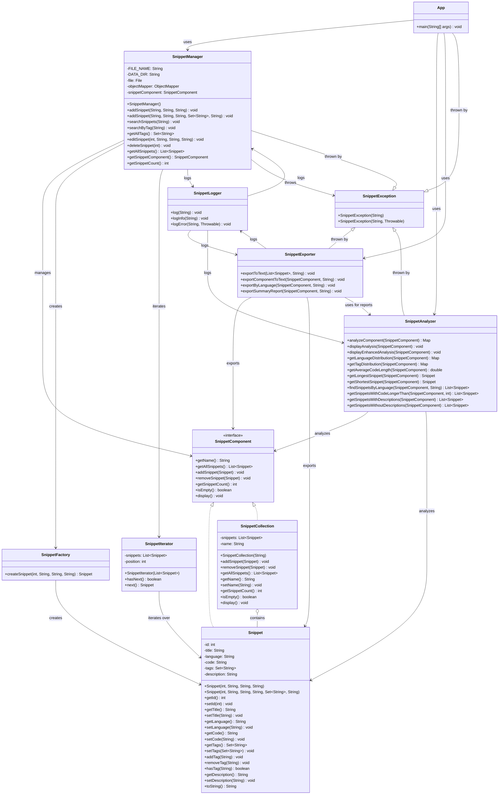

# SNIPPET ORGANIZER 

## Project Objective

Create a Java application that allows users to save, organize, and search code snippets offline, in a fast, secure, and structured way, without the need for a database. Data is saved to files in a dedicated `data/` directory.

## Data Directory

All application data is stored in the `data/` directory:
- `snippets.json`: - All snippets are stored here as a JSON array. Every add, edit, or delete operation rewrites the entire file to ensure consistency and compatibility with any JSON tool.
- `snippet_organizer.log`: All actions and errors are logged to here. The log file is automatically rotated if it exceeds 1MB.

## User Experience (Step-by-step)

The app can be used via console (CLI).

**Phase 1: Application Start**
 
When the user starts the app, a main menu appears:

```shell
--- CODE SNIPPET ORGANIZER ---
1. Add new snippet
2. Search snippets
3. Edit snippet
4. Delete snippet
5. Export snippets
6. Analyze snippets
7. Manage tags
0. Close application
Select an option:
```

**Phase 2: Adding a Snippet**

You can add a snippet with just a title, language, and code, or provide optional tags and a description. 

User selects 1 → App asks:

```shell
Title:
> Bubble Sort Java

Language:
> Java

Description (optional):
> Efficient sorting algorithm with O(n²) complexity

Tags (comma-separated, optional):
> sorting, algorithm, java, bubble-sort

Enter the code (end with "X" on a new line):
> for (int i = 0; i < arr.length; i++) {
>     ...
> }
> X
```

The snippet is saved in a file, `data/snippets.json`, with its metadata, tags, and description.

**Phase 3: Searching Snippets**
User selects 2 → Can search by:

- **Keyword Search**: Search across title, code, language, tags, and description
- **Tag Search**: Find snippets by specific tags

Example:

```shell
Search options:
1. Search by keyword
2. Search by tag
Select search type: 1

Enter search keyword: sort
```

App shows:

```shell
Found snippet:
ID: 1
Title: Bubble Sort Java
Language: Java
Description: Efficient sorting algorithm with O(n²) complexity
Tags: sorting, algorithm, java, bubble-sort
Code:
for (int i = 0; i < arr.length; i++) {
    ...
}
---------------------------
```

**Phase 4: Edit / Delete**

Options 3 and 4: User chooses a snippet, modifies or deletes it. The app handles everything by updating the file.

**Phase 5: Export Snippets**

Export all snippets to a single txt file with detailed formatting including tags and descriptions. Files are saved in the `data/` directory. You can also export by language or as a summary report.

**Phase 6: Analyze Snippets**

Comprehensive analysis including:
- Language distribution
- Tag distribution and statistics
- Description statistics
- Code length analysis
- Longest/shortest snippets

**Phase 7: Manage Tags**

- View all tags in the collection
- Add tags to existing snippets
- Remove tags from snippets
- Search snippets by specific tags

## Advanced Features

- **Tag Management:** Add, remove, view, and search tags for any snippet.
- **Analysis:** Get statistics on language usage, tag distribution, code length, and more.
- **Export:** Export all snippets, by language, or as a summary report to text files.
- **Extensible CLI:** All business logic is decoupled from the CLI, making it easy to extend or adapt to other interfaces.

## Design Patterns Used

- **Composite Pattern:** `SnippetComponent` interface, with `Snippet` (leaf) and `SnippetCollection` (composite).
- **Factory Pattern:** `SnippetFactory` for creating new snippets.
- **Iterator Pattern:** `SnippetIterator` for traversing snippet collections.
- **Exception Shielding Pattern:** All low-level errors are wrapped in a custom `SnippetException`, ensuring only user-friendly, meaningful errors are exposed to the user and logged. This shields the application from internal exceptions and improves robustness and security.

## Error Handling

All business logic errors are reported as user-friendly messages and logged. The application uses a custom `SnippetException` for robust error management.

## Testing

- The project includes comprehensive unit tests using **JUnit 5**.
- Tests cover all major features: adding, editing, deleting, searching, tag management, analysis, and error cases.
- To run tests: use your IDE's test runner or `mvn test`.
- High code coverage is maintained to ensure reliability.

## Documentation

- All classes and methods are documented with **JavaDoc**.
- The codebase is thoroughly commented for clarity and maintainability.
- The README includes a **UML class diagram** (see below) to illustrate the architecture and design patterns.

## UML Class Diagram



## Documentation and Justification

### Project Overview
The Snippet Organizer is designed to be a lightweight, offline-first code snippet management system. It prioritizes simplicity, portability, and ease of use while maintaining robust functionality for code organization.

### Design Decisions

1. **File-based Storage**
   - Uses JSON for data persistence
   - All files stored in dedicated `data/` directory
   - Easy to backup and version control

2. **CLI First Approach**
   - Simple and fast interface
   - Keyboard-driven workflow

3. **Enhanced Organization**
   - Tags system for better categorization
   - Descriptions for better documentation
   - Multiple search options for easy retrieval

### Technical Patterns

1. **Factory Pattern**
   - `SnippetFactory` for creating snippets
   - Encapsulates object creation
   - Makes it easy to modify creation logic

2. **Composite Pattern**
   - `SnippetComponent` interface for uniform treatment
   - `Snippet` as leaf nodes and `SnippetCollection` as composite nodes
   - Allows treating individual snippets and collections uniformly
   - Enables hierarchical organization of code snippets

3. **Iterator Pattern**
   - `SnippetIterator` for traversing snippets
   - Hides implementation details
   - Consistent access to collections

4. **Exception Shielding Pattern**
   - Custom `SnippetException` class
   - Meaningful error messages
   - Proper error handling

### Core Technologies

1. **Collections Framework**
   - `List` for snippet collections
   - `Set` for tags (prevents duplicates)
   - Custom collections and iterators

2. **Generics**
   - Type-safe collections
   - Reusable components
   - Better code organization

3. **Java I/O**
   - File-based storage in `data/` directory
   - JSON serialization
   - Export functionality

4. **Logging System**
   - Custom `SnippetLogger` class
   - Timestamp tracking for all operations
   - Automatic log rotation (deletes logs > 1MB)
   - Error and info logging
   - Log file: `data/snippet_organizer.log`

5. **JUnit Testing**
   - Unit tests for core functionality
   - Test coverage for critical paths
   - Automated testing

6. **Maven for Jackson**
   - JSON serialization
   - Data persistence
   - Easy dependency management

### Secure Programming

1. **Input Sanitization**
   - Validation of all user inputs
   - Prevention of empty/null values
   - Safe file operations

2. **No Hardcoded Secrets**
   - Configuration-based approach
   - Secure file handling
   - No sensitive data exposure

3. **Controlled Exception Propagation**
   - Custom exception handling
   - Meaningful error messages
   - Proper error recovery

## Getting Started

1. Clone the repository `git clone https://github.com/Dandastino/SnippetOrganizer.git`
2. Change the directory `cd SnippetOrganizer`
3. Build with Maven: `mvn clean install`
4. Run the application: `java -jar target/demo-1.0-SNAPSHOT.jar`

## Project Structure

```
SnippetOrganizer/
├── src/
│   ├── main/java/com/snippetorganizer/
│   │   ├── App.java
│   │   ├── SnippetManager.java
│   │   ├── Snippet.java
│   │   ├── SnippetCollection.java
│   │   ├── SnippetComponent.java
│   │   ├── SnippetFactory.java
│   │   ├── SnippetIterator.java
│   │   ├── SnippetException.java
│   │   ├── SnippetLogger.java
│   │   ├── SnippetAnalyzer.java
│   │   └── SnippetExporter.java
│   └── test/java/com/snippetorganizer/
│       ├── SnippetManagerTest.java
│       ├── SnippetTest.java
│       ├── SnippetCollectionTest.java
│       ├── SnippetIteratorTest.java
│       ├── SnippetLoggerTest.java
│       ├── SnippetAnalyzerTest.java
│       ├── SnippetExporterTest.java
│       ├── SnippetFactoryTest.java
│       ├── SnippetExceptionTest.java
│       └── TestDataUtil.java
├── data/
│   ├── snippets.json
│   └── snippet_organizer.log
├── target/                        
├── pom.xml                        
├── .gitignore                     
└── README.md                      
```

## Usage Examples

### GIF

work in progress..
