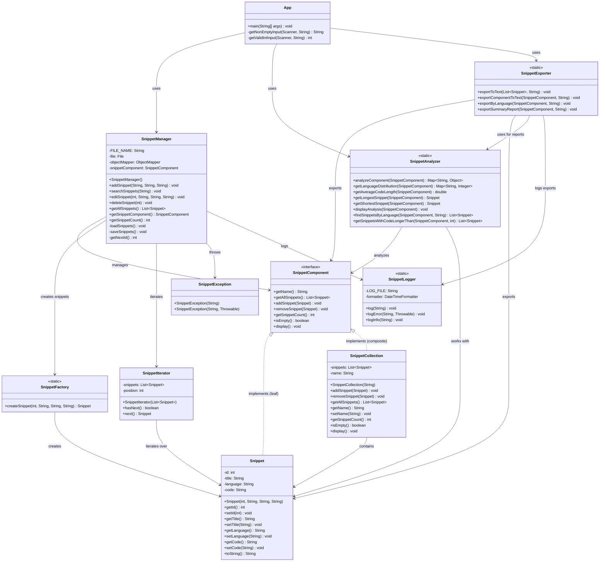

# SNIPPET ORGANIZER 

## 🧠 Project Objective

Create a Java application that allows users to save, organize, and search code snippets offline, in a fast, secure, and structured way, without the need for a database. Data is saved to files.

## 👤 User Experience (Step-by-step)

The app can be used via console (CLI).

**✅ Phase 1: Application Start**
 
When the user starts the app, a main menu appears:

```shell
--- CODE SNIPPET ORGANIZER ---
1. Add new snippet
2. Search snippets
3. Edit snippet
4. Delete snippet
5. Export snippets
6. Analyze snippets
0. Close application
Select an option:
```

**✅ Phase 2: Adding a Snippet**

User selects 1 → App asks:

```shell
Title:
> Bubble Sort Java

Language:
> Java

Enter the code (end with "X" on a new line):
> for (int i = 0; i < arr.length; i++) {
>     ...
> }
> X
```

The snippet is saved in a file, snippets.json, with its metadata.

**✅ Phase 3: Searching Snippets**
User selects 2 → Can search by:

- Title
- Language
- Code

Example:

```shell
Search snippets by keyword:
> sort
```

App shows:

```shell
Found 2 snippets:
1. Bubble Sort Java [Java] 
2. Merge Sort Python [Python]
```

Shows snippets associated with the selected keyword.

**✅ Phase 4: Edit / Delete**

Options 3 and 4: User chooses a snippet, modifies or deletes it. The app handles everything by updating the file.

**✅ Phase 5: Export Snippets**

Export all snippets to a single txt file with detailed formatting.

## 📊 UML Class Diagram



## 📚 Documentation and Justification

### Project Overview
The Snippet Organizer is designed to be a lightweight, offline-first code snippet management system. It prioritizes simplicity, portability, and ease of use while maintaining robust functionality for code organization.

### Design Decisions

1. **File-based Storage**
   - Uses JSON for data persistence
   - Easy to backup and version control

2. **CLI First Approach**
   - Simple and fast interface
   - Keyboard-driven workflow

### Technical Patterns

1. **Factory Pattern**
   - `SnippetFactory` for creating snippets
   - Encapsulates object creation
   - Makes it easy to modify creation logic

2. **Composite Pattern**
   - `SnippetComponent` interface for uniform treatment
   - `Snippet` as leaf nodes and `SnippetCollection` as composite nodes
   - Allows treating individual snippets and collections uniformly
   - Enables hierarchical organization of code snippets

3. **Iterator Pattern**
   - `SnippetIterator` for traversing snippets
   - Hides implementation details
   - Consistent access to collections

4. **Exception Shielding Pattern**
   - Custom `SnippetException` class
   - Meaningful error messages
   - Proper error handling

### Core Technologies

1. **Collections Framework**
   - `List` for snippet collections
   - Custom collections and iterators

2. **Generics**
   - Type-safe collections
   - Reusable components
   - Better code organization

3. **Java I/O**
   - File-based storage
   - JSON serialization
   - Export functionality

4. **Logging System**
   - Custom `SnippetLogger` class
   - Timestamp tracking for all operations
   - Automatic log rotation (deletes logs > 1MB)
   - Error and info logging
   - Log file: `snippet_organizer.log`

5. **JUnit Testing**
   - Unit tests for core functionality
   - Test coverage for critical paths
   - Automated testing

6. **Maven for Jackson**
   - JSON serialization
   - Data persistence
   - Easy dependency management

### Secure Programming

1. **Input Sanitization**
   - Validation of all user inputs
   - Prevention of empty/null values
   - Safe file operations

2. **No Hardcoded Secrets**
   - Configuration-based approach
   - Secure file handling
   - No sensitive data exposure

3. **Controlled Exception Propagation**
   - Custom exception handling
   - Meaningful error messages
   - Proper error recovery

## 🚀 Getting Started

1. Clone the repository `git clone https://github.com/Dandastino/SnippetOrganizer.git`
2. Change the directory `cd SnippetOrganizer`
3. Build with Maven: `mvn clean install`
4. Run the application: `java -jar target/demo-1.0-SNAPSHOT.jar`

## 📝 Usage Examples

### Adding a Snippet
```shell
Title: Quick Sort
Language: Java
Code:
public void quickSort(int[] arr) {
    // Implementation
}
X
```

### Searching Snippets
```shell
Search keyword: sort
```

### Exporting Snippets
```shell
Export all snippets to a single file
Enter output filename: my_snippets.txt
```

**Export Function Details:**
- Exports all snippets to a single text file
- Each snippet includes ID, title, language, and full code
- Formatted with clear separators between snippets
- Useful for backup, sharing, or documentation purposes
- File is created in the current working directory

**Logging System Details:**
- All operations are logged with timestamps
- Log file: `snippet_organizer.log`
- Automatic log rotation (deletes old logs > 1MB)
- Tracks: snippet additions, edits, deletions, exports, and errors
- Helps with debugging and audit trails

**✅ Gif Tutorial**


## 🔧 Configuration

The application uses the following configuration:
- `snippets.json`: Main data file containing all snippets
- `snippet_organizer.log`: Log file with operation history
- Export directory: User-specified (defaults to current directory)

## 📦 Dependencies

- Jackson for JSON processing
- JUnit for testing
- Maven for build management

